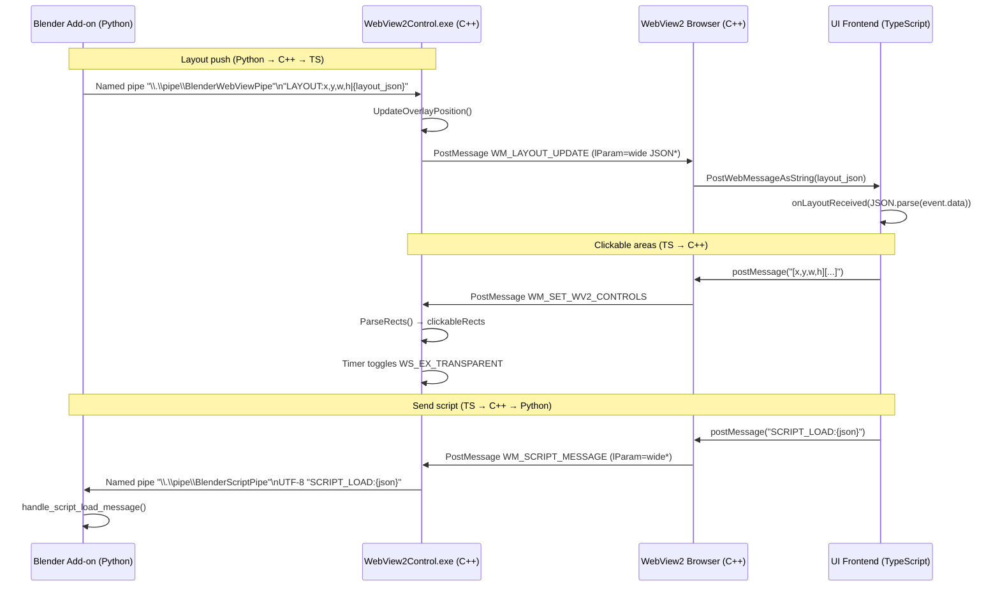

# BlenderWebUI

A Windows WebView2 overlay UI for Blender. It embeds a transparent C++ window on top of Blender and communicates with a React/TypeScript frontend and a Blender Python add-on via WebView2 messages and Windows named pipes.

https://github.com/user-attachments/assets/a90dc15e-caff-4703-8bf3-faf59be5d819

## Highlights
- **Overlay UI**: Transparent, click-through when not over interactive regions.
- **Two-way IPC**:
  - Python → C++ → TS: Blender layout JSON pushed to the web UI and used to render anchor/docking zones.
  - TS → C++ → Python: Sends Python scripts (with parameters) into Blender’s Text Editor.
  - TS → C++: Reports UI clickable rectangles so the C++ window toggles mouse passthrough.
- **Single-binary runner**: `WebView2Control.exe` hosts WebView2 and loads `web_ui/index.html` from the add-on bundle.

## Project Structure
- `WebView2Control/` C++ WebView2 host and IPC/Win32 code.
  - `src/BlenderWebView2.cpp` main app, window proc, pipe thread, layout handling.
  - `src/BlenderWebView2.h` declarations, custom messages, buffer sizes.
  - `src/WebView2Browser.cpp/.h` WebView2 wrapper and message bridge.
- `UIFrontend/` React + Vite frontend.
  - `src/components/WebViewCommunication.ts` WebView2 messaging shim.
  - `src/components/product-catalog/ProductCatalogWindow.tsx` sends scripts to Blender.
  - `scripts/` sample Python scripts fetched at runtime by the UI.
- `PythonScript/install_in_blender.py` Blender add-on: launches C++ app, streams layout, listens for scripts to inject.
- `build-all.bat` One-click build and package into a Blender add-on zip.

## Build and Package
Prerequisites:
- Visual Studio 2022 (Desktop development with C++) or VS Build Tools (includes msbuild, VC tools). `vswhere` must be present (standard with VS Installer).
- Node.js LTS (for UI build) and internet access for `npm install`.

Steps:
1. Run from repo root:
   - `build-all.bat`
2. Outputs:
   - UI build: `UIFrontend/dist/`
   - C++ app: `WebView2Control/x64/Release/`
   - Add-on bundle: `addon.zip` at repo root

What the script does:
- Builds Vite frontend (installs npm deps if missing).
- Builds C++ WebView2 app via MSBuild (x64 Release).
- Stages `web_ui` assets and `bin` with `WebView2Control.exe` and `WebView2Loader.dll`.
- Writes `blender_manifest.toml` and zips everything into `addon.zip`.

## Format and Checks (optional)
From repo root: `format-all.bat`
- Python: Black on `PythonScript/` and `UIFrontend/scripts/`
- UI: Prettier, ESLint, and TypeScript type-check (`tsc --noEmit`)
- C++: clang-format and clang-tidy (uses `compile_commands.json` if present)
- Requires tools on PATH: `black`, `npx` (Node.js), `clang-format`, `clang-tidy`

## Install in Blender
1. Blender → Edit → Preferences → Add-ons → Install…
2. Select `addon.zip` from repo root.
3. Enable “WebView Panel Tracker”.
4. In 3D View → Sidebar → “WebView” tab:
   - Click “Launch WebView” to start overlay.
   - “Stop WebView” to terminate and clean up.

## Runtime Flow (UML)

## IPC Protocols and Message Formats
- Named pipes:
  - `\\.\pipe\BlenderWebViewPipe` (Python → C++)
  - `\\.\pipe\BlenderScriptPipe` (C++ → Python)
- Layout message (Python → C++):
  - Prefix: `LAYOUT:` then `x,y,w,h|<layout_json>` without whitespace.
  - Source: `PythonScript/install_in_blender.py::send_window_info()`
  - Parsed and validated in `BlenderWebView2.cpp::ProcessLayoutMessage()`.
- Script message (TS → C++ → Python):
  - Prefix: `SCRIPT_LOAD:` then `{ json }` with fields like `name`, `content`, `parameters`.
  - Sent from `ProductCatalogWindow.tsx` via `webViewCommunication.sendMessage()`.
  - Routed by `WebView2Browser::OnWebMessageReceived()` → `WM_SCRIPT_MESSAGE` → `sendScriptToBlender()`.
  - Consumed by `install_in_blender.py::script_listener_worker()` → `handle_script_load_message()`.
- Clickable rects (TS → C++):
  - String of concatenated rects: `[x,y,w,h][x,y,w,h]...` for elements with class `.clickable-area`.
  - Emitted by `WebViewCommunication.ts::reportClickableAreas()` on a timer.
  - Parsed in C++ `ParseRects()` and stored in `WebView2Browser::clickableRects`.

## Custom Windows Messages and Windowing
- `WM_SET_WV2_CONTROLS = WM_USER`
  - Set by `WebView2Browser` when TS posts rects; `WndProc` parses and stores rectangles.
- `WM_LAYOUT_UPDATE = WM_USER + 1` (declared in `BlenderWebView2.h`)
  - When Python pushes layout via pipe, C++ posts the JSON to WebView2 as a string for TS to consume.
- `WM_SCRIPT_MESSAGE = WM_USER + 2`
  - Indicates a `SCRIPT_LOAD:` message ready to forward to Python via `BlenderScriptPipe`.
- `POSITION_TIMER_ID = 1`
  - Periodically toggles `WS_EX_TRANSPARENT` based on whether the mouse is over any clickable rect.
- Transparent color key: `TRANS_COLOR = RGB(0xDF, 0xFE, 0xEF)`.

## Key Code References
- `WebView2Control/src/BlenderWebView2.cpp`:
  - `handleIPC()` thread reads `BlenderWebViewPipe` and triggers `WM_LAYOUT_UPDATE`.
  - `sendScriptToBlender()` writes to `BlenderScriptPipe`.
  - `WndProc()` processes `WM_SET_WV2_CONTROLS`, `WM_LAYOUT_UPDATE`, `WM_SCRIPT_MESSAGE`.
- `WebView2Control/src/WebView2Browser.cpp`:
  - `OnWebMessageReceived()` bridges `postMessage` from TS to Win32 messages.
- `UIFrontend/src/components/WebViewCommunication.ts`:
  - Handles WebView2 `message` events and sends rects/messages to C++.
- `UIFrontend/src/components/product-catalog/ProductCatalogWindow.tsx`:
  - Composes and sends `SCRIPT_LOAD` messages with script content and parameters.
- `PythonScript/install_in_blender.py`:
  - Streams layout via `BlenderWebViewPipe` and receives scripts via `BlenderScriptPipe`.

## Development Notes
- The C++ app loads `web_ui/index.html` from the add-on’s bundled files (file:// URI). Live dev servers are not wired; build the UI (`npm run build`) to update assets.
- Verify Visual Studio and VC tools are installed (the build script uses `vswhere` to locate MSBuild).
